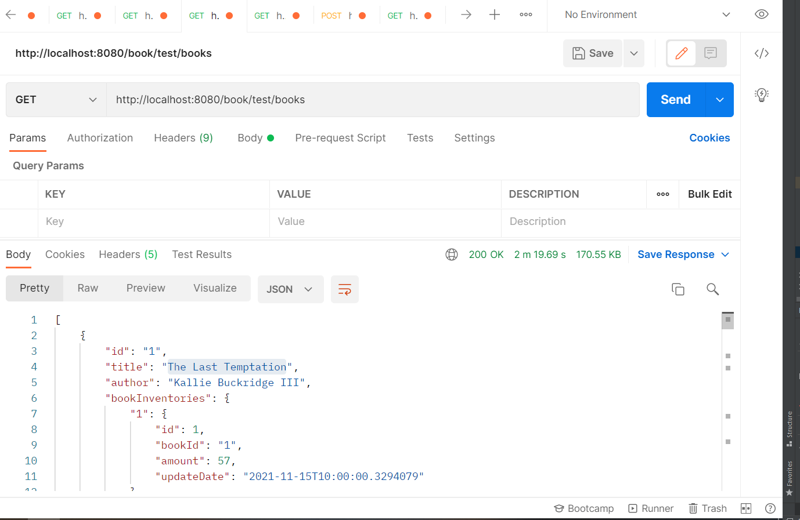
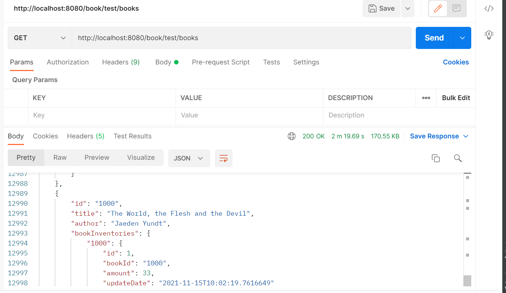
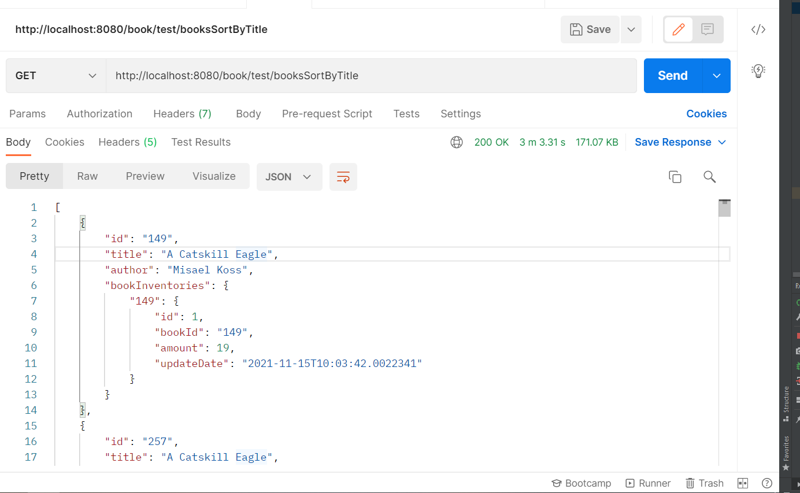
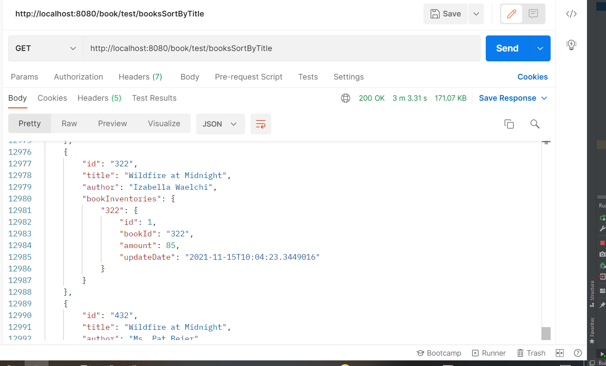
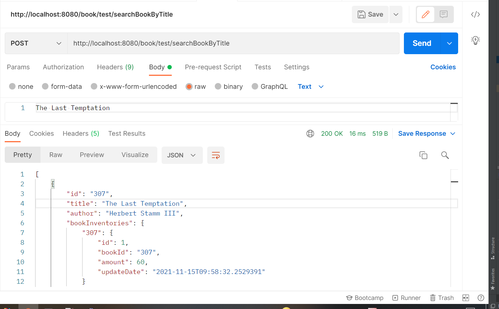
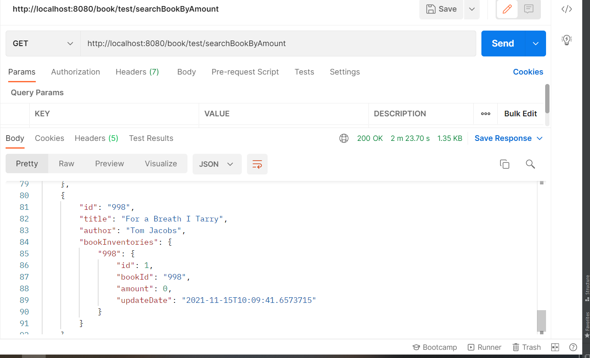
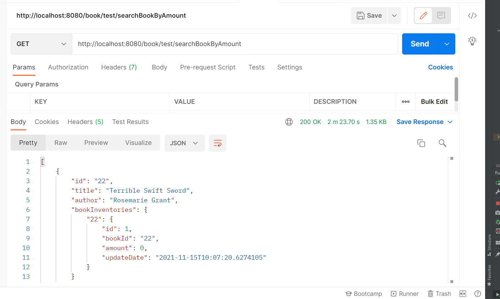

#Bài tập 1 lớp Spring boot

Bài tập: Lập trình một ứng dụng REST của một cửa hàng sách bán sách trực tuyến, giao sách đến tận nhà người mua.

- Các data của 1000 đầu sách được xây dựng dựa trên java Faker. Mỗi lượt chạy các data sẽ được ramdom ra 1000 đầu sách khác nhau. Có 2 model chủ yếu chính là Book( quản lý các đầu sách cụ thể) và
- BookInventory (quản lý những record thay đổi của từng đối tượng Book) với số lượng amount được ramdom từ 0 - 100.

1. Ban đầu 1000 đầu sách được tạo ra theo thứ tự ngẫu nhiên và những bản record của sách được mặc định là 1, với id của sách là giá trị index mà sách được nhập vào là từ 1 - 1000.
Các đata của một đầu sách sẽ được hiện luôn từng bản record của đầu sách đó mỗi lần update
Dưới đây là 2 ảnh về giá trị đầu và cuối của Books sau khi đã tạo data

2. Liệt kê các đầu sách xếp theo tiêu chí title từ A-Z. Sắp xếp theo title của từng đầu sách với hàm Comparator trong model Book được truyền vào 2 đầu sách khác nhau.
Với các title giống nhau, sẽ sắp xếp theo các id của đầu sách đó. Dưới đây là 2 data đầu và cuối của book sau khi sắp xếp theo title

3. Tìm đầu sách có title chứa keyword nào đó. Trong body tại request truyền vào theo phương thức POST sẽ là nơi nhập các keyword mà người dùng muốn tìm kiếm.
Hàm "searchBookByTitle" sẽ nhận giá trị key đó và đem so sánh với từng title của Book đã có. Nếu trường hợp không có đầu sách nào. Phương thức sẽ ko trả về giá trị
Data dưới là trường hợp truyền vào keyword và trả về 1 list Book

4. Liệt kê các đầu sách hiện đang hết amount = 0. So sánh các amount của từng Book với 0. Phương thức GET sau khi chạy request sẽ trả về một List Book với những Book có giá trị amount = 0.
Dưới đây là 2 giá trị đầu và cuối trong List Book

5. Giả lập lệnh mua sách buy_book, mặc định số lượng mua là 1 quyển, nhưng có thể mua nhiều hơn 1 quyển. 
Với lệnh POST được truyền vào 2 giá trị là id book và numberBook. Cho phép nhận id của sách sau đó truyền vào số lượng những sách đã mua.
+ Khi sách có giá trị amount  = 0. Request sẽ trả về kết quả là "Books with amount = 0"
+ Khi số sách muốn mua lớn hơn số sách có trong Kho sẽ trả về "The number of books purchased is more than the number of books available, amount = "(số sách hiện có)"
+ Khi id và số sách được truyền vào hợp lệ sẽ trả về câu lệnh "Buy (số sach) book is (tên sách).

6. Số lượng mua lớn số lượng sách có trong kho hãy tạo một event để đặt hàng thêm sách nhập về kho. Về phần event e chưa thể test được kết quả. Tuy vậy em có làm việc order book sẽ được nhận
vào giá trị id của Book và số lượng sách order. Nếu order thành công sẽ trả về câu lệnh báo đã order thành công

